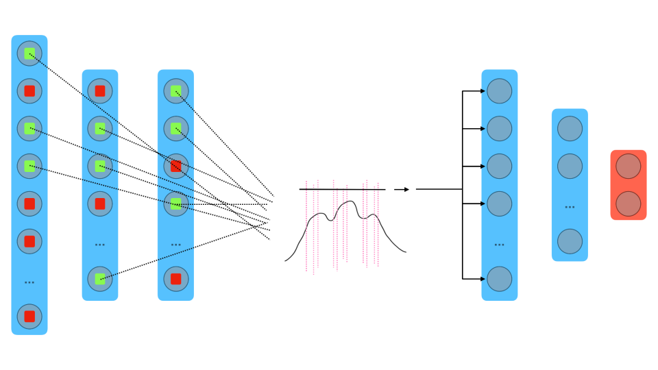
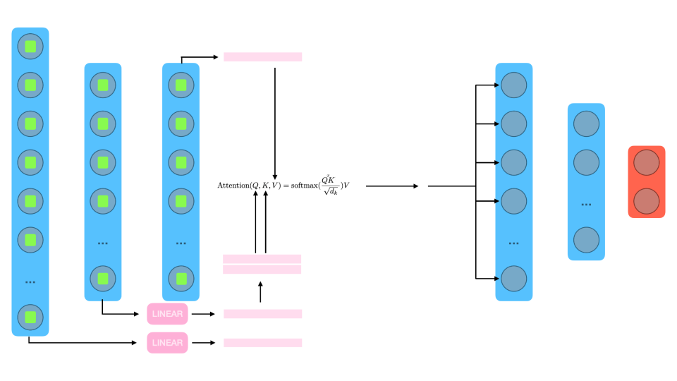

# D2BL: Dynamic Distribution-driven Backpropagation Learning
> [**D2BL: Investigation on distribution-driven backpropagation learning**](https://github.com/404/),            
> [Andrea Coppari](https://it.linkedin.com/in/andreacoppari1005), [Riccardo Tedoldi](https://www.instagram.com/riccardotedoldi/)
Supervisor: [Andrea Ferigo](https://it.linkedin.com/in/andrea-ferigo), [Giovanni Iacca](https://it.linkedin.com/in/giovanniiacca)   
> *Project Bio-inspired, Spring 2023* 

*Figure (a)*

*Figure (b)*

*Figure (c)*

### TODO LIST

- [ ] IMPLEMENT VQ-VAE
- [ ] Compare latent spaces (FabLAB seminar plot angle and distance)
- [ ] Parallel axis plot
- [ ] Evaluate hebbian + distribution driven learning
- [x] Implement pipeline with hebbian
- [x] Fix-image
- [x] Chose eval metrics

## Overview
Provide overview of the project
## Features
Provide a detailed list of the files involved and how to use them.
## Installation
How to install/run and requirements

## Usage
How to use

## Contributing
### Contact
If you have suggestions or ideas for further improvemets please contact us.
- riccardo tedoldi: [@riccardotedoldi](https://www.instagram.com/riccardotedoldi/)
- andrea coppari: [@andreacoppari](https://it.linkedin.com/in/andreacoppari1005)

Also, if you find any bugs or issues, please let us know. We are happy to fix them!

## License
Which license is it under?

## Cite this work
```bibtex
@misc{CoppariTedoldi2023,
    title   = {Dynamic Learning of Embodied Abstractions},
    author  = {Andrea Coppari, Riccardo Tedoldi},
    year    = {2023},
    url  = {https://github.com/r1cc4r2o/d-lea}
}
```
D-LeA: Dynamic Learning of Embodied Abstractions
## Reference to other works

``` bibtex
@inproceedings{talloen2020pytorchhebbian,
  author       = {Jules Talloen and Joni Dambre and Alexander Vandesompele},
  location     = {Online},
  title        = {PyTorch-Hebbian: facilitating local learning in a deep learning framework},
  year         = {2020},
}
```