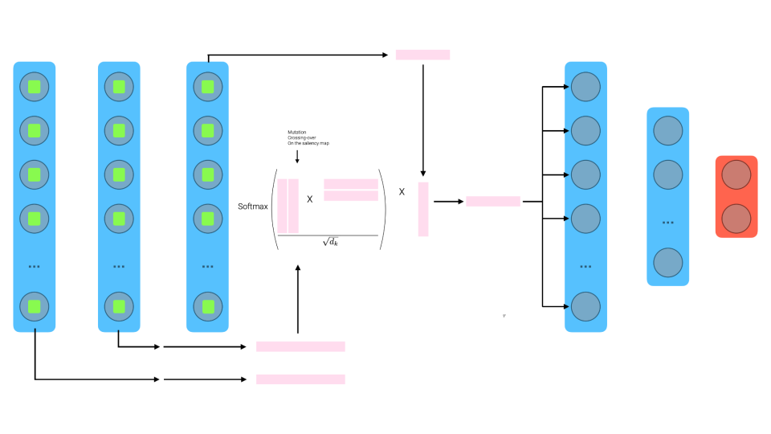
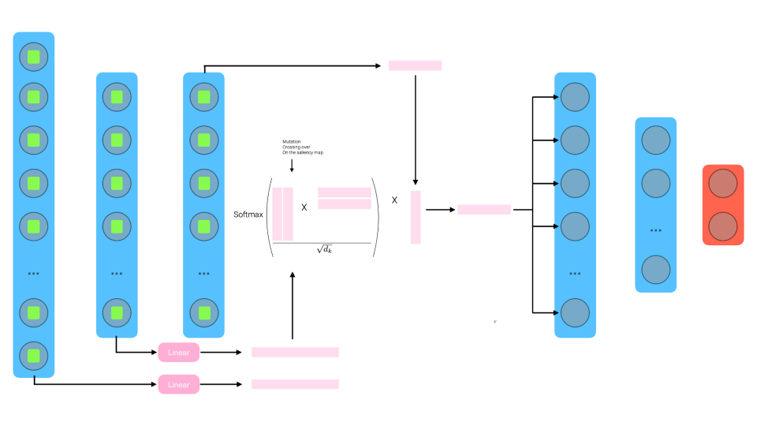

# D2BL: Dynamic Distribution-driven Backpropagation Learning
> [**D2BL: Investigation on distribution-driven backpropagation learning**](https://github.com/404/),            
> [Andrea Coppari](https://it.linkedin.com/in/andreacoppari1005), [Riccardo Tedoldi](https://www.instagram.com/riccardotedoldi/)
Supervisor: [Andrea Ferigo](https://it.linkedin.com/in/andrea-ferigo), [Giovanni Iacca](https://it.linkedin.com/in/giovanniiacca)  
> *Project Bio-inspired, Spring 2023* 
<p align="center">D2BL with KDE learning</p>
<p align="center">
 
 
</p>
<p align="center">D2BL with pseudo-attention mechanism with and without crossing-over and mutations</p>
<p align="center">
 
 
</p>
<p align="center">Pseudo-attention mechanism for fine-tuning</p>
<p align="center">
 
</p>


## Overview

In this repo, we report novel experiments to get activations conditioned on the representations extracted from previous stages of the network. We are trying to simulate what already happens in the brain. 

The brain initially processes stimuli at a low level, after which the signal is sent to higher cognitive areas involved in mental processes such as attention, memory, language, problem-solving, decision making and creativity. These higher cognitive areas are distributed throughout the brain, including the prefrontal cortex, hippocampus, frontal lobe and others, and various combinations of these areas work together to support different cognitive tasks. 

Specifically, our layer tries to exploit novel representations using this idea. The first idea that we propose combine the past representations using KDE (kernel density estimation) in two different ways. Whereas, with the second idea we combine the past activations using a pseudo-attention mechanism from which we get a saliency map that is used as a weighting factor of the activations of the immediately preceding layer. Once we are computing the gradients during backprop, the operations introduced so far will influence the gradients in extracting novel representations.
## Features

The structure of the repository is as follows:

+ The `d2bl` folder contains a cleaned and documented version of all the investigations conducted, including:
  + the implementation of layers for `kde_learning`, 
  + the implementation of layers with the `pseudo-attention` mechanism on past activations, 
  + the implementation of layers with the weight updating through the `hebbian`-like learning rule for fine-tuning  pre-trained models,
  + the implementation of layers with the `pseudo-attention` mechanism for fine-tuning pre-trained models
  + additionally, the folder `simulations` includes experiments with self-driving and boids flocking simulations using the pseudo-attention layer, compared to a DQN-Agent.
+ The `tests` folder contains some tests that have been conducted and promising investigations for the future.

## Installation
How to install/run and requirements

## Usage
How to use

## Contributing
### Contact
If you have suggestions or ideas for further improvemets please contact us.
- riccardo tedoldi: [@riccardotedoldi](https://www.instagram.com/riccardotedoldi/)
- andrea coppari: [@andreacoppari](https://it.linkedin.com/in/andreacoppari1005)

Also, if you find any bugs or issues, please let us know. We are happy to fix them!

## License
Which license is it under?


<!-- ### TODO LIST

- [ ] IMPLEMENT VQ-VAE
- [ ] Compare latent spaces (FabLAB seminar plot angle and distance)
- [ ] Parallel axis plot
- [ ] Evaluate hebbian + distribution driven learning
- [x] Implement pipeline with hebbian
- [x] Fix-image
- [x] Chose eval metrics -->
## Cite us
```bibtex
@misc{CoppariTedoldi2023,
    title   = {Dynamic Learning of Embodied Abstractions},
    author  = {Andrea Coppari, Riccardo Tedoldi},
    year    = {2023},
    url  = {https://github.com/r1cc4r2o/d-lea}
}
```

