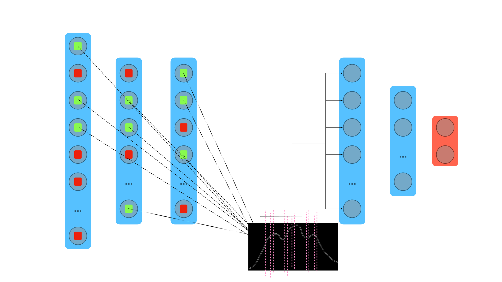

# D-LeA
Dynamic Learning of Embodied Abstractions



## Cite this work
```bibtex
@misc{CoppariTedoldi2023,
    title   = {Dynamic Learning of Embodied Abstractions},
    author  = {Andrea Coppari, Riccardo Tedoldi},
    year    = {2023},
    url  = {https://github.com/r1cc4r2o/d-lea}
}
```

## Reference
```
@inproceedings{talloen2020pytorchhebbian,
  author       = {Jules Talloen and Joni Dambre and Alexander Vandesompele},
  location     = {Online},
  title        = {PyTorch-Hebbian: facilitating local learning in a deep learning framework},
  year         = {2020},
}
```