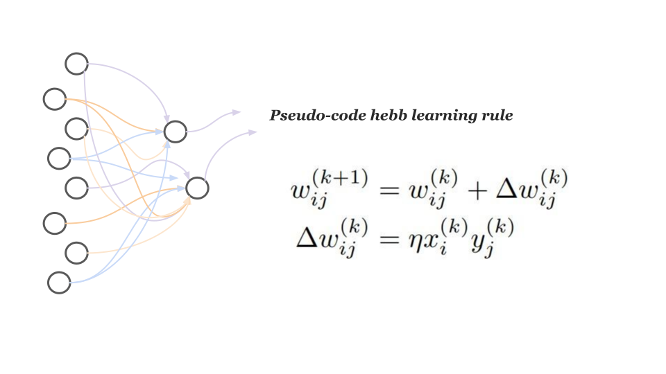

### Info

Hebbian learning rule

 

Fine-tuning RN50 with one hebbian layer

[resnet_hebb.ipynb](https://github.com/r1cc4r2o/D2BL/blob/main/d2bl/hebbian/resnet_hebb.ipynb)

Fine-tuning VGG19 with one hebbian layer

[vgg19_hebb.ipynb](https://github.com/r1cc4r2o/D2BL/blob/main/d2bl/hebbian/vgg19_hebb.ipynb)

Fine-tuning RN50 with multiple hebbian layer

[resnet_deep_hebb.ipynb](https://github.com/r1cc4r2o/D2BL/blob/main/d2bl/hebbian/resnet_deep_hebb.ipynb)
