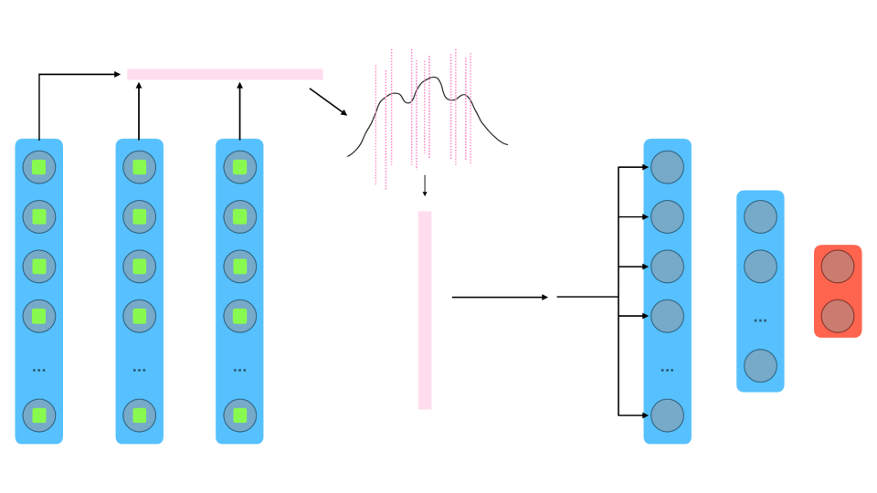
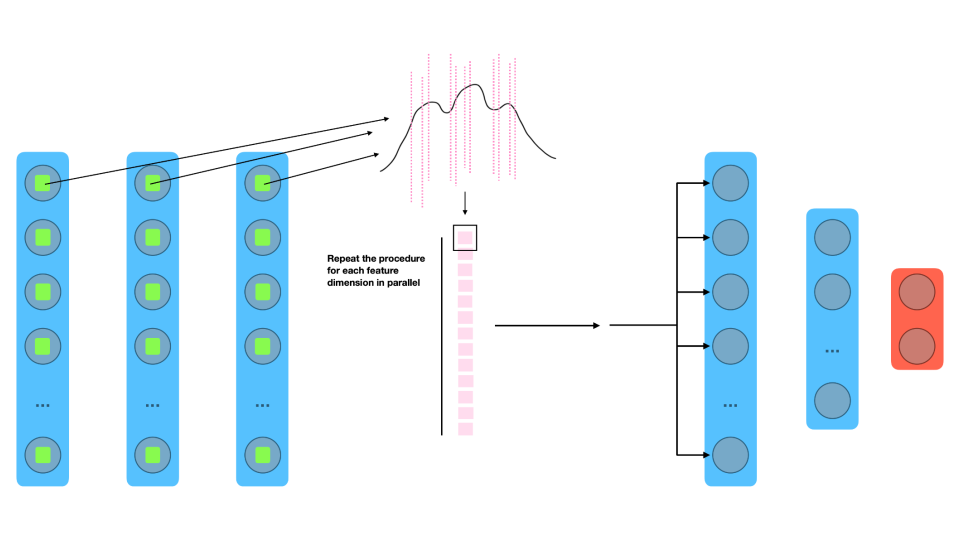

### Info

KDE learning on a single staked representation

[0_kde_learning.ipynb](https://github.com/r1cc4r2o/D2BL/blob/main/d2bl/kde_learning/0_kde_learning.ipynb)

 

KDE learning on the feature dimensions of past representations

[1_kde_learning.ipynb](https://github.com/r1cc4r2o/D2BL/blob/main/d2bl/kde_learning/1_kde_learning.ipynb)

 

