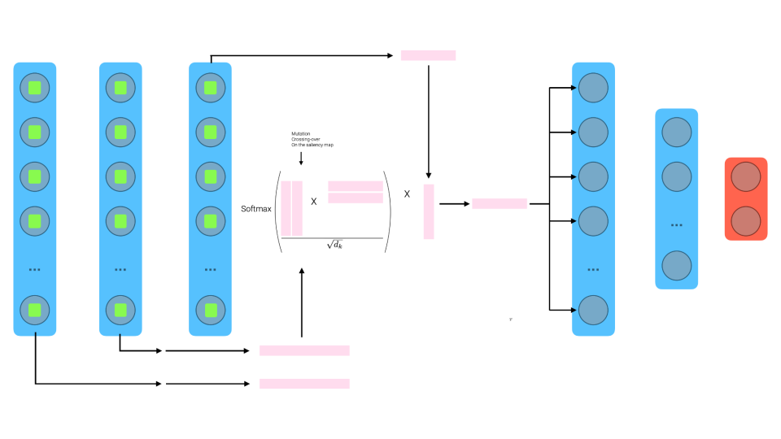

### Info

LinW pseudo-attention mechanism without crossing-over and mutations

[pseudo-attention.ipynb](https://github.com/r1cc4r2o/D2BL/blob/main/d2bl/pseudo-attention/pseudo-attention.ipynb)

 

LinW pseudo-attention mechanism with crossing-over and mutations

[1_pseudo-attention-mut-cross.ipynb](https://github.com/r1cc4r2o/D2BL/blob/main/d2bl/pseudo-attention/1_pseudo-attention-mut-cross.ipynb)

 

LinW pseudo-attention mechanism with crossing-over and mutations for fine-tuning RN50 and VGG19 

[2_rn50_linW.ipynb](https://github.com/r1cc4r2o/D2BL/blob/main/d2bl/pseudo-attention/2_rn50_linW.ipynb)

[2_vgg19_linW.ipynb](https://github.com/r1cc4r2o/D2BL/blob/main/d2bl/pseudo-attention/2_vgg19_linW.ipynb)

 

